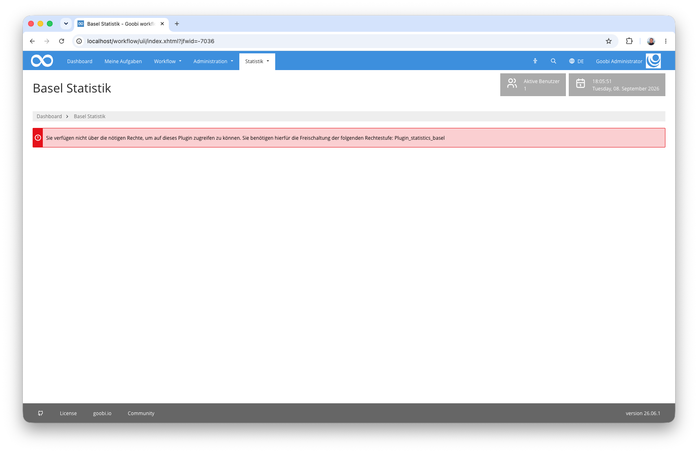
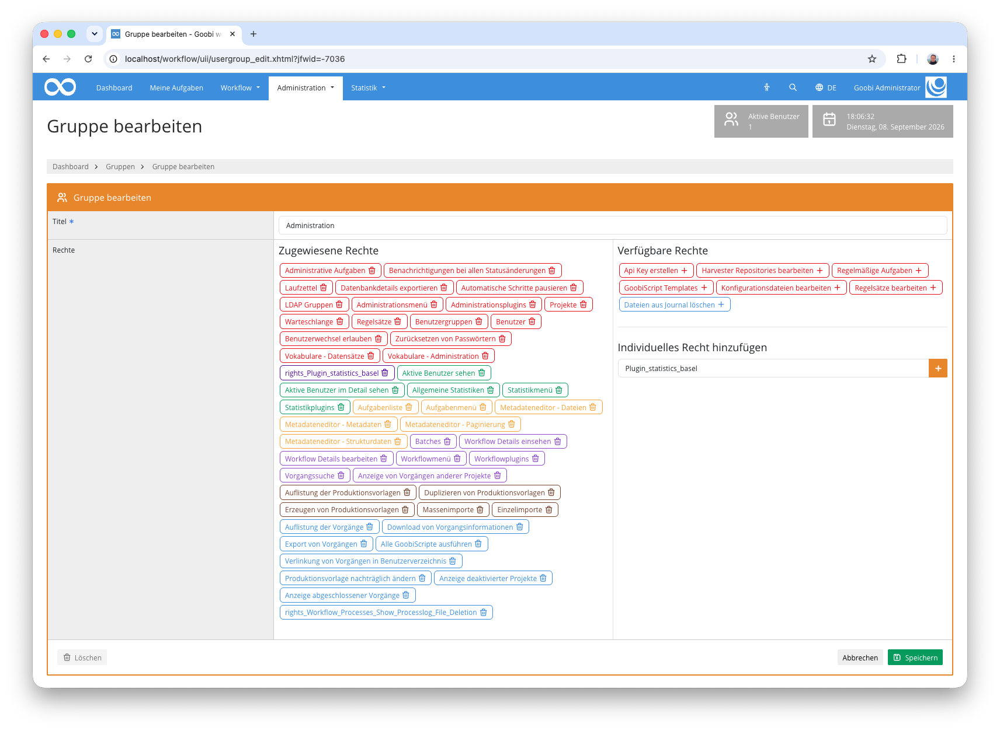
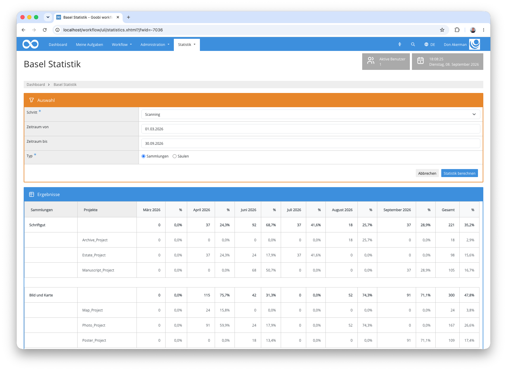

## Einführung
Dieses Statistik-Plugin ermöglicht die Auswertung von abgeschlossenen Arbeitsschritten über mehrere Goobi-Projekte hinweg. Die Ergebnisse werden gruppiert nach konfigurierbaren Sammlungen oder thematischen Säulen als Tabelle dargestellt, die für jeden Monat die Anzahl der digitalisierten Seiten und den prozentualen Anteil ausweist. Die Ergebnisse können zusätzlich als Excel-Datei heruntergeladen werden.


## Installation
Um das Plugin nutzen zu können, müssen folgende Dateien installiert werden:

```bash
/opt/digiverso/goobi/plugins/statistics/plugin-statistics-basel-base.jar
/opt/digiverso/goobi/plugins/GUI/plugin-statistics-basel-gui.jar
/opt/digiverso/goobi/config/plugin_intranda_statistics_basel.xml
```


## Berechtigungen
Das Plugin ist zugriffsbeschränkt. Fehlt einem Nutzer die erforderliche Rolle, so ist die Seite zwar erreichbar, zeigt aber statt der Auswertung einen entsprechenden Hinweis an:



Damit ein Nutzer das Plugin verwenden kann, muss seine Nutzergruppe über die folgenden Rollen verfügen:

| Berechtigung | Beschreibung |
|---|---|
| `Plugin_statistics_basel` | Ermöglicht den Zugriff auf das Basel-Statistik-Plugin und die Auswertung projektübergreifender Digitalisierungsleistungen. |
| `Statistics_Menu` | Blendet das Menü `Statistik` ein. Ohne diese Rolle ist das Plugin nicht erreichbar. |
| `Statistics_Plugins` | Blendet innerhalb des Menüs `Statistik` die Statistik-Plugins ein. |

Um die Rollen einer Nutzergruppe zuzuweisen, öffnen Sie die Goobi-Verwaltungsoberfläche und navigieren Sie zu `Administration` > `Benutzergruppen`. Wählen Sie die gewünschte Gruppe aus oder legen Sie eine neue an. Die beiden Rollen `Statistikmenü` und `Statistikplugins` lassen sich direkt aus der Liste der verfügbaren Rechte übernehmen. Die plugin-eigene Rolle `Plugin_statistics_basel` tragen Sie in das Feld `Individuelles Recht hinzufügen` ein und bestätigen die Eingabe:



Nach dem Speichern erscheint die Rolle in der Liste der zugewiesenen Rechte. Da für individuell vergebene Rechte keine Übersetzung hinterlegt ist, wird sie dort als `rights_Plugin_statistics_basel` angezeigt.

Bitte beachten Sie, dass Nutzer mit Superadmin-Status sämtliche Rechteprüfungen umgehen. Für sie ist das Plugin auch dann sichtbar, wenn die Rolle nicht zugewiesen wurde.


## Überblick und Funktionsweise
Wenn das Plugin korrekt installiert und konfiguriert wurde, ist es innerhalb des Menüpunkts `Statistik` zu finden.

Im Bereich `Auswahl` legen Sie fest, was ausgewertet werden soll:

| Feld | Erläuterung |
|---|---|
| `Schritt` | Pflichtfeld. Zur Auswahl stehen sämtliche Schritttitel, die in der Goobi-Installation vorkommen — unabhängig davon, ob es zu ihnen bereits abgeschlossene Vorgänge gibt. |
| `Zeitraum von` | Optional. Begrenzt die Auswertung auf Schritte, die nach diesem Datum abgeschlossen wurden. |
| `Zeitraum bis` | Optional. Begrenzt die Auswertung auf Schritte, die vor diesem Datum abgeschlossen wurden. |
| `Typ` | Pflichtfeld. Bestimmt, nach welcher der beiden konfigurierten Kategorien gruppiert wird: `Sammlungen` oder `Säulen`. |

Beide Datumsfelder sind unabhängig voneinander verwendbar. Bleiben sie leer, so wird der gesamte vorhandene Zeitraum ausgewertet.

Gezählt werden ausschließlich Arbeitsschritte im Status *abgeschlossen*. Maßgeblich für die Einordnung in eine Monatsspalte ist das Abschlussdatum des gewählten Schritts. Als Seitenzahl wird die im Vorgang hinterlegte Anzahl der Bilder herangezogen.

### Auswertung nach Sammlungen
Bei der Auswahl `Sammlungen` werden die Projekte gemäß der Kategorie `Sammlungen` aus der Konfigurationsdatei gruppiert. Jede Gruppe erscheint als fett gedruckte Zeile mit den summierten Werten, darunter stehen die einzelnen Projekte der Gruppe. Für jeden Monat werden die Seitenzahl und der prozentuale Anteil am Gesamtvolumen des jeweiligen Monats ausgewiesen. Die Spalte `Gesamt` am rechten Rand summiert über den gewählten Zeitraum.



### Auswertung nach Säulen
Die Auswahl `Säulen` wertet dieselben Daten aus, gruppiert sie jedoch nach der Kategorie `Säulen`. Da ein Projekt in beiden Kategorien unterschiedlichen Gruppen zugeordnet sein kann, lässt sich derselbe Datenbestand auf diesem Weg aus zwei Blickwinkeln betrachten — etwa einmal nach Materialart und einmal nach strategischer Zuordnung.


Unterhalb der Tabelle steht die gesamte Auswertung über die Schaltfläche `Excel herunterladen` als Excel-Datei zur Verfügung.


## Konfiguration
Die Konfiguration des Plugins erfolgt in der Datei `plugin_intranda_statistics_basel.xml` wie hier aufgezeigt:

```xml
<?xml version="1.0" encoding="UTF-8"?>
<config_plugin>
    <category name="Sammlungen">
        <group name="Gruppe 1">
            <project>Projekt A</project>
            <project>Projekt B</project>
            <project>Projekt C</project>
        </group>
        <group name="Gruppe 2">
            <project>Projekt D</project>
            <project>Projekt E</project>
            <project>Projekt F</project>
        </group>
        <group name="Gruppe 3">
            <project>Projekt G</project>
            <project>Projekt H</project>
        </group>
    </category>
    <category name="Säulen">
        <group name="Säule 1">
            <project>Projekt A</project>
            <project>Projekt B</project>
            <project>Projekt C</project>
            <project>Projekt D</project>
            <project>Projekt E</project>
        </group>
        <group name="Säule 2">
            <project>Projekt F</project>
            <project>Projekt G</project>
        </group>
        <group name="Säule 3">
            <project>Projekt H</project>
        </group>
    </category>
</config_plugin>
```

Die folgende Tabelle enthält eine Zusammenstellung der Parameter und ihrer Beschreibungen:

Parameter               | Erläuterung
------------------------|------------------------------------
`category`              | Definiert eine Anzeigevariante. Der Wert des Attributs `name` muss entweder `Sammlungen` oder `Säulen` lauten, da diese fest im Plugin verankert sind.
`group`                 | Fasst mehrere Projekte zu einer benannten Gruppe zusammen. Der Wert des Attributs `name` wird in der Tabelle als Gruppenbezeichnung angezeigt.
`project`               | Gibt den genauen Namen eines Goobi-Projekts an, das zur übergeordneten Gruppe gehört. Der Name muss exakt mit dem Projektnamen in Goobi übereinstimmen.

Die Projektnamen sind die häufigste Fehlerquelle: Stimmt ein Eintrag `<project>` nicht exakt mit einem in Goobi vorhandenen Projekt überein, so wird er bei der Auswertung stillschweigend übergangen. Sind alle Einträge einer Gruppe betroffen, bleibt die Tabelle ohne Fehlermeldung leer. Prüfen Sie in diesem Fall die Schreibweise der Projektnamen unter `Administration` > `Projekte`.
