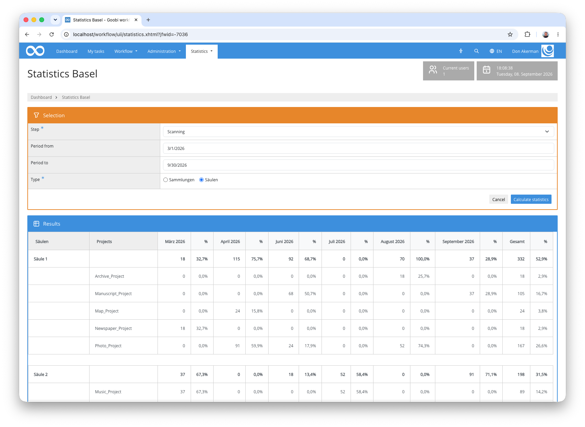

## Introduction
This statistics plugin enables the evaluation of completed workflow steps across multiple Goobi projects. Results are grouped according to configurable collections or thematic columns and displayed as a table showing the number of digitised pages and the percentage share for each month. The results can also be downloaded as an Excel file.


## Installation
To use the plugin, the following files must be installed:

```bash
/opt/digiverso/goobi/plugins/statistics/plugin-statistics-basel-base.jar
/opt/digiverso/goobi/plugins/GUI/plugin-statistics-basel-gui.jar
/opt/digiverso/goobi/config/plugin_intranda_statistics_basel.xml
```


## Permissions
Access to the plugin is restricted. If a user lacks the required role, the page can still be opened but shows a corresponding notice instead of the evaluation:


For a user to work with the plugin, their user group needs the following roles:

| Permission | Description |
|---|---|
| `Plugin_statistics_basel` | Grants access to the Basel statistics plugin and enables cross-project evaluation of digitisation output. |
| `Statistics_Menu` | Displays the `Statistics` menu. Without this role the plugin cannot be reached. |
| `Statistics_Plugins` | Displays the statistics plugins within the `Statistics` menu. |

To assign the roles to a user group, open the Goobi administration interface and navigate to `Administration` > `User groups`. Select the desired group or create a new one. The two roles `Statistics menu` and `Statistics plugins` can be taken directly from the list of available rights. Enter the plugin's own role `Plugin_statistics_basel` into the `Add individual right` field and confirm it:


After saving, the role appears in the list of assigned rights. As individually granted rights have no translation, it is displayed there as `rights_Plugin_statistics_basel`.

Please note that users with superadmin status bypass all permission checks. For them the plugin is visible even if the role has not been assigned.


## Overview and Functionality
Once the plugin has been correctly installed and configured, it can be found under the `Statistics` menu item.

The `Selection` area determines what is evaluated:

| Field | Description |
|---|---|
| `Step` | Mandatory. The list offers every step title occurring in the Goobi installation, regardless of whether completed processes exist for it. |
| `Period from` | Optional. Limits the evaluation to steps completed after this date. |
| `Period to` | Optional. Limits the evaluation to steps completed before this date. |
| `Type` | Mandatory. Determines which of the two configured categories is used for grouping: `Sammlungen` (collections) or `Säulen` (columns). |

Both date fields can be used independently of one another. If they are left empty, the entire available period is evaluated.

Only workflow steps with the status *completed* are counted. A step is assigned to a month column by its completion date. The number of images stored with the process is used as the page count.

### Evaluation by collections
Selecting `Sammlungen` groups the projects according to the `Sammlungen` category of the configuration file. Each group appears as a bold row holding the summed values, with the individual projects of the group listed below it. For every month, the page count and the percentage share of that month's total volume are shown. The `Gesamt` column on the right sums up the selected period.


### Evaluation by columns
Selecting `Säulen` evaluates the same data but groups it according to the `Säulen` category. Since a project can belong to different groups in each category, this allows the same body of data to be viewed from two angles — for example once by material type and once by strategic assignment.



Below the table, the complete evaluation is available as an Excel file via the `Download Excel` button.

Please note that the two `Type` options, the heading of the first table column and the month names are not translated and therefore appear in German even when the interface language is set to English. The option labels are fixed in the plugin, and the column heading is taken from the `name` attribute of the configured category.


## Configuration
The plugin is configured in the file `plugin_intranda_statistics_basel.xml` as shown here:

```xml
<?xml version="1.0" encoding="UTF-8"?>
<config_plugin>
    <category name="Sammlungen">
        <group name="Group 1">
            <project>Project A</project>
            <project>Project B</project>
            <project>Project C</project>
        </group>
        <group name="Group 2">
            <project>Project D</project>
            <project>Project E</project>
            <project>Project F</project>
        </group>
        <group name="Group 3">
            <project>Project G</project>
            <project>Project H</project>
        </group>
    </category>
    <category name="Säulen">
        <group name="Column 1">
            <project>Project A</project>
            <project>Project B</project>
            <project>Project C</project>
            <project>Project D</project>
            <project>Project E</project>
        </group>
        <group name="Column 2">
            <project>Project F</project>
            <project>Project G</project>
        </group>
        <group name="Column 3">
            <project>Project H</project>
        </group>
    </category>
</config_plugin>
```

The following table provides an overview of the parameters and their descriptions:

Parameter               | Description
------------------------|------------------------------------
`category`              | Defines a display variant. The value of the `name` attribute must be either `Sammlungen` or `Säulen`, as these are fixed in the plugin.
`group`                 | Groups several projects under a named heading. The value of the `name` attribute is displayed as the group label in the results table.
`project`               | Specifies the exact name of a Goobi project belonging to the parent group. The name must match the project name in Goobi exactly.

Project names are the most common source of error: if a `<project>` entry does not match a project present in Goobi exactly, it is silently skipped during the evaluation. If this affects every entry of a group, the table remains empty without any error message. In that case, check the spelling of the project names under `Administration` > `Projects`.
