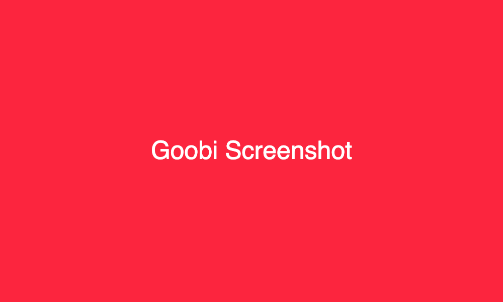
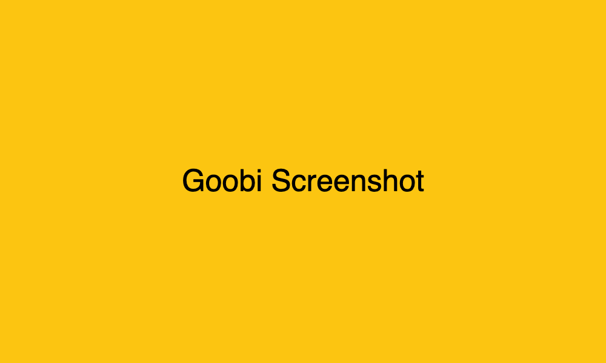
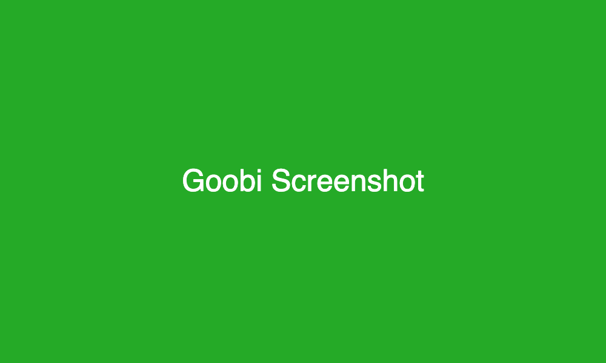

## Introduction
This Statistics plugin allows you to ZZZ.

## Installation
In order to use the plugin, the following files must be installed:

```bash
/opt/digiverso/goobi/plugins/statistics/plugin-statistics-ZZZ-base.jar
/opt/digiverso/goobi/plugins/GUI/plugin-statistics-ZZZ-gui.jar
/opt/digiverso/goobi/config/plugin_intranda_statistics_ZZZ.xml
```

To use this plugin, the user must have the correct role authorisation.



Therefore, please assign the role `ZZZ` to the group.




## Overview and functionality
If the plugin has been installed and configured correctly, it can be found under the `Statistics` menu item.



ZZZ


## Configuration
The plugin is configured in the file `plugin_intranda_statistics_ZZZ.xml` as shown here:

{{CONFIG_CONTENT}}

The following table contains a summary of the parameters and their descriptions:

Parameter               | Explanation
------------------------|------------------------------------
``                      | 
``                      | 
``                      | 
``                      | 
``                      | 
``                      | 
``                      | 
``                      | 
``                      | 
``                      | 
``                      | 
``                      | 
``                      | 
``                      | 
``                      | 
``                      | 
``                      | 
``                      | 
``                      | 
``                      | 
``                      | 
``                      | 
``                      | 
``                      | 
``                      | 
``                      | 
``                      | 
